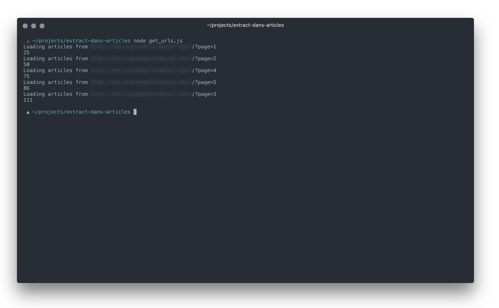
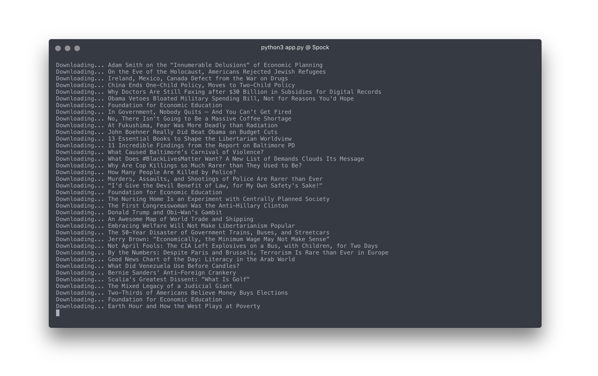

# Simple Article Extraction Project
This weekend’s web challenge was to grab all 109 of my boyfriend’s op-eds from a particular website and export them into a Medium-friendly format so he can add them to his blog.

Challenges:
1. Medium will only let you import Wordpress-style XML.
2. This particular website’s RSS feed for authors isn’t available.
3. I’ve totally never written a web-crawler before.

But whatever! I might need to do this for a client at work soon anyway, so I figured it was worth figuring out.

I started out with [this very neat Python library called Newspaper](https://github.com/codelucas/newspaper/). I’ve never written Python before, but it is just lovely compared to PHP, and this library does basically all of the heavy lifting in terms of article parsing.

```
news = newspaper.build('http://fee.org')
print(news.size())
```

The first few times I ran this first script, I ended up with this:

`>>> Total Articles for Source: 37`

… which was obviously not true.

Either Newspaper wasn’t waiting to download all the articles from the website before executing the `.size()` method, or there was something funky going on with the URL schema of the website that Newspaper wasn’t handling correctly.

Newspaper *was* parsing article data from individual URLs beautifully, so I figured a simple solution could be to grab an array of the links I wanted, pass that array to my python script, and iterate over that. Since my familiarity with Python is, to a pretty close approximation, zero, I turned to Javascript to solve this problem.

This website helpfully has author archive pages, with a paginated list of links to articles associated with that author. So my first step was, given a URL to an author’s archive page, find the box on that page with links to their articles and stash those href’s in an array:

```
// get_urls.js

var request = require("request");
var cheerio = require("cheerio");
var links = [];

request({url: url}, function(error, response, body) {
  if (!error && response.statusCode == 200) {
    var path = response.request.headers.referer;
    // Load response body into Cheerio
    var $ = cheerio.load(body);

    // Find author's box and the links we want in it
    $(config.html_link_selector).each(function() {
		// Because this site's <a> tags are all relative, make sure we're creating the full url for our Python script
      links.push('\n\'' + config.host + $(this).attr('href') + '\'');
    });

    // Where we at?
    console.log("Loading articles from " + path);
    console.log(links.length);
  }
});
```

Now that I could collect an array of links by crawling a specific page, I wanted to loop through all the archive pages associated with this author and collect those links too.

I split the cheerio logic into a separate `getLinksFromHTML` callback function, and put the request call in a for loop that iterates over a given set of paginated urls:

```
for (i = 1; i < pages + 1; i++) {
  var url = link_base + '?page=' + i;
  request({url: url}, getLinksFromHTML);
}
```

Last step: write our array of links to a python file once the script is finished. As I'm learning, functional programming is really helpful in these cases: the asynchronous nature of Javascript means this all happens super fast -- but it also means I have no idea which page will be the "last" one to finish running.



*Hmm, that's not how I expected you to count to five...*

So in this case, what I actually want to do is run our write function each time we complete our page crawl:

```
function writeToFile() {
  fs.writeFile('extracted_links.py', 'links = [' + links + ']');
}
```


```
function getLinksFromHTML(error, response, body) {
  if (!error && response.statusCode == 200) {
    var path = response.request.headers.referer;
    // Load response body into Cheerio
    var $ = cheerio.load(body);

    // Find authors box and all H2 links in it
    $(config.html_link_selector).each(function() {
      links.push('\n\'' + config.host + $(this).attr('href') + '\'');
    });

    // Where we at?
    console.log("Loading articles from " + path);
    console.log(links.length);

    writeToFile();
  }
}
```

When we run `$ node get_urls.js` from the terminal, we now get a python file with every URL associated with this author’s archive. :rocket:

Okay, *now* we can go back to our Python script, import our links array from the `extracted_links.py` file we built with JS, define our HTML escape rules, iterate through the links, and let Newspaper do its awesomeness:

```
from newspaper import Article
from extracted_links import links
articles = []

# Defile HTML escape options
html_escape_table = {
   '"': "&quot;",
   "'": "&apos;"
   }

for link in links:
    article = Article(link, language='en', keep_article_html=True)
    article.download()
    article.parse()
    article.nlp()
    print("Downloading... " + article.title)
    date = article.publish_date.isoformat()
    data = {
        "date" : date,
        "originalURL": link,
        "title": article.title,
        "summary": article.summary,
        "plainText": article.text,
        "keywords": article.keywords,
        "articleHTML": html.escape(article.article_html, html_escape_table)
        }
		articles.append(data)
```

From here, it’s a pretty simple matter to tell Python to write that data to either JSON or CSV — in the repository, there’s both.



And voila! A .csv and a JSON file with all the articles, their titles, their text, & escaped HTML of just the article content.
